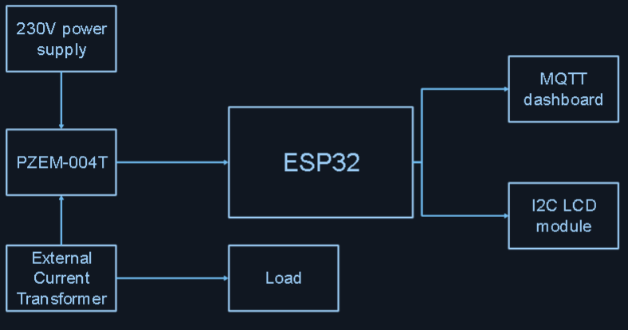
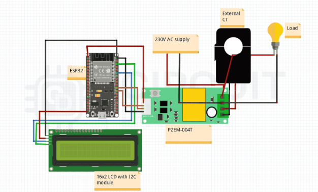
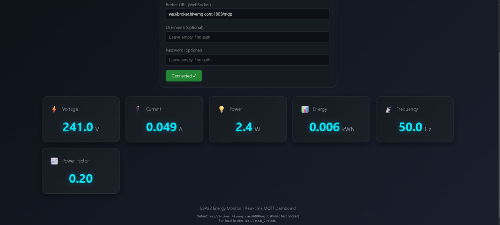

# ⚡ IoT Smart Energy Meter with MQTT & Alerts

An IoT-based Smart Energy Meter built using **ESP32** and **PZEM-004T** to monitor real-time electrical parameters such as voltage, current, power, energy, frequency, and power factor.  
The system supports **MQTT-based dashboards** and **real-time alerts via SMS and Telegram**.

---

## 🚀 Features

- 📡 Real-time energy monitoring
- 📊 Web-based MQTT dashboard
- 🔔 Alerts for:
  - Power cut & restoration
  - Over-voltage / under-voltage
  - Over-current & overload
  - Frequency abnormalities
  - Sensor communication errors
- 📱 Telegram & SMS notifications
- 💡 LCD display for local monitoring

---

## 🛠️ Hardware Components

| Component | Description |
|--------|-------------|
| ESP32 | DOIT ESP32 DEVKIT V1 |
| PZEM-004T v4.0 | Energy measurement module |
| CT Clamp | Current measurement |
| LCD | 16x2 I2C LCD |
| Breadboard & Jumpers | Prototyping |
| Power Supply | USB |

---

## 🧠 System Architecture

---

## 💻 Firmware Variants

| Version | Description |
|------|-------------|
| MQTT Basic | Real-time MQTT publishing |
| SMS Alert | High-voltage SMS alerts |
| Telegram Alert | Full alert system with Telegram |

Source codes are available in the `firmware/` directory.

---

## 🌐 Web Dashboard

- Built using **HTML, CSS, JavaScript**
- Uses **MQTT over WebSockets**
- Real-time visualisation of electrical parameters

---

## 📄 Documentation

Full project documentation including theory, circuit design, and code explanation:

📘 [View Documentation](docs/Smart_Energy_Meter_Documentation.pdf)

---

## 🎥 Demo

📹 Project demo video available in the `media/` folder.

---

## 📌 Future Improvements

- Cloud data logging
- Mobile app integration
- Energy consumption analytics
- Smart billing integration

---

## 👤 Author

**Abdul Rahman**  
Biomedical Engineering Undergraduate  
ESP32 | IoT | Embedded Systems

---

## 📜 License

This project is licensed under the MIT License.

---

## ✅ Complete Setup & Usage Guide

This section summarises the **critical steps required to make the system fully functional**, including wiring, MQTT configuration, Telegram integration, and testing modes.

---

## 🔌 1. Hardware & Wiring Recap

### ESP32 ↔ I2C LCD (16×2 with I2C Backpack)

| LCD Pin | ESP32 Pin |
|------|-----------|
| VCC | 5V (or 3.3V if supported) |
| GND | GND |
| SDA | GPIO 21 |
| SCL | GPIO 22 |

- Common I2C addresses: `0x27` or `0x3F`
- If only the backlight is visible, adjust the **contrast potentiometer** on the LCD backpack.

---

### ESP32 ↔ PZEM-004T v4.0 (100A CT Version)

| PZEM Pin | ESP32 Pin |
|-------|----------|
| TX | RX2 (GPIO 16) |
| RX | TX2 (GPIO 17) |
| GND | GND |
| VCC | 5V (module dependent) |

- **CT clamp must go around ONLY the live conductor**
- The ESP32 must be powered separately via **USB or 5V supply**
- Measuring mains voltage does **NOT** power the ESP32

---

## 🌐 2. MQTT & Web Dashboard Configuration

### MQTT Broker (TCP)
- **Host:** `broker.hivemq.com`
- **Port:** `1883`

### WebSocket (Dashboard)
- **URL:** `ws://broker.hivemq.com:8000/mqtt`

HiveMQ supports **both TCP and WebSocket on the same broker**, allowing the ESP32 and dashboard to work together seamlessly.

### MQTT Topics (Must Match Dashboard)
- unique/energy/voltage
- unique/energy/current
- unique/energy/power
- unique/energy/energy
- unique/energy/frequency
- unique/energy/pf
- unique/energy/data (JSON payload)

---

## 🤖 3. Telegram Bot Features

### A. Automatic Alert System (Anti-Spam + Hysteresis)

- Power cut & restoration
- PZEM sensor communication failure
- Over / under voltage
- Over current
- Over power
- Frequency abnormal
- MQTT disconnect & reconnect
- Wi-Fi reconnect notification

Alerts respect:
- Cool-down timers
- Mute state
- User pairing status

---

### B. Supported Telegram Commands

- **/status** → Live readings + system state
- **/alerts on** → Enable alerts
- **/alerts off** → Disable alerts
- **/mute 10m** → Temporarily mute alerts (supports s, m, h, d)
- **/unmute** → Resume alerts
- **/help** → Show command list
- **/forget** → Clear paired chat ID

---

### C. Secure Chat-ID Pairing (No Hardcoded IDs)

1. On first boot, LCD displays a **6-digit pairing code**
2. User sends `/start` to the bot
3. Bot requests pairing using `/pair <CODE>`
4. ESP32 stores the authorised `chat_id` securely in flash (Preferences)
5. Device responds **only** to the paired user thereafter

---

### D. Telegram Duplicate Reply Fix

- Telegram `update_id` tracking is implemented
- Old queued messages are discarded after reboot
- Prevents repeated `/status` replies

---

## 🧪 4. Serial Simulation Mode (Safe Testing Without Mains)

Simulation mode allows testing alerts **without live AC voltage**.

### Serial Commands
- help
- sim normal
- sim mainsoff
- sim commerr
- sim overv
- sim underv
- sim overi
- sim overp
- sim freqbad
- sim off

This is extremely useful for:
- Debugging
- Demonstrations
- Academic evaluation

---

## 📚 5. Required Arduino Libraries

Install via **Arduino Library Manager**:

- `PZEM004Tv30`
- `PubSubClient`
- `UniversalTelegramBot`
- `ArduinoJson`
- `LiquidCrystal_I2C`

> ⚠️ Architecture warnings for LCD libraries are common on ESP32.  
> If issues occur, use the `hd44780` library with I2C expander support.

ESP32 core already provides:
- `WiFi`
- `Wire`
- `HardwareSerial`
- `Preferences`

---

## 🧠 6. Complete Integrated Firmware

- Full ESP32 firmware (MQTT + LCD + Telegram + Alerts + Simulation Mode)
- Located in: 

### User Configuration Required

Replace the following placeholders before uploading:
- YOUR_WIFI_SSID
- YOUR_WIFI_PASSWORD
- YOUR_TELEGRAM_BOT_TOKEN

---

## 🧩 7. Telegram Bot

 **VoltSentry ⚡** 

---

## 🔐 8. Security Notice

Since Wi-Fi credentials and bot tokens are used:

- Change Wi-Fi password if exposed
- Regenerate Telegram bot token via **BotFather**
- Never commit credentials to public repositories
